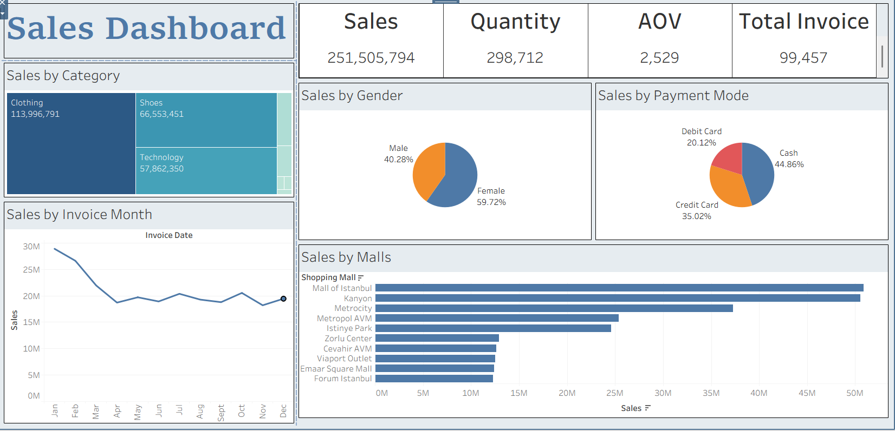

# Sales Dashboard (Tableau)

## Overview
This project presents an interactive sales dashboard built using Tableau to analyze retail sales performance.

## Key Metrics
- Total Sales
- Quantity Sold
- Average Order Value (AOV)
- Total Invoices

## Dashboard Insights
- Sales by Category
- Sales by Gender
- Sales by Payment Mode
- Monthly Sales Trend
- Sales by Shopping Malls

## Tools Used
- Tableau
- Data Visualization
- Data Analysis

## Dashboard Preview

